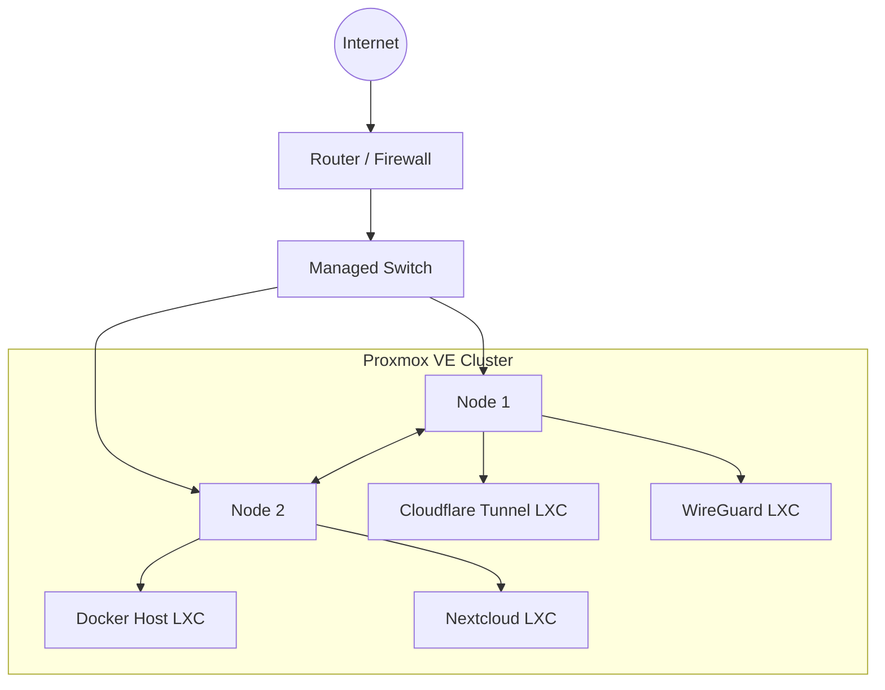

# Architecture Diagram

```mermaid
flowchart TB
    Internet((Internet))
    Router[Router / Firewall]
    Switch[Managed Switch]

    Internet --> Router
    Router --> Switch

    subgraph Cluster[Proxmox VE Cluster]
        PVE1[Node 1]
        PVE2[Node 2]
        PVE1 <--> PVE2

        CF[Cloudflare Tunnel LXC]
        WG[WireGuard LXC]
        DK[Docker Host LXC]
        NC[Nextcloud LXC]

        PVE1 --> CF
        PVE1 --> WG
        PVE2 --> DK
        PVE2 --> NC
    end

    Switch --> PVE1
    Switch --> PVE2
```
