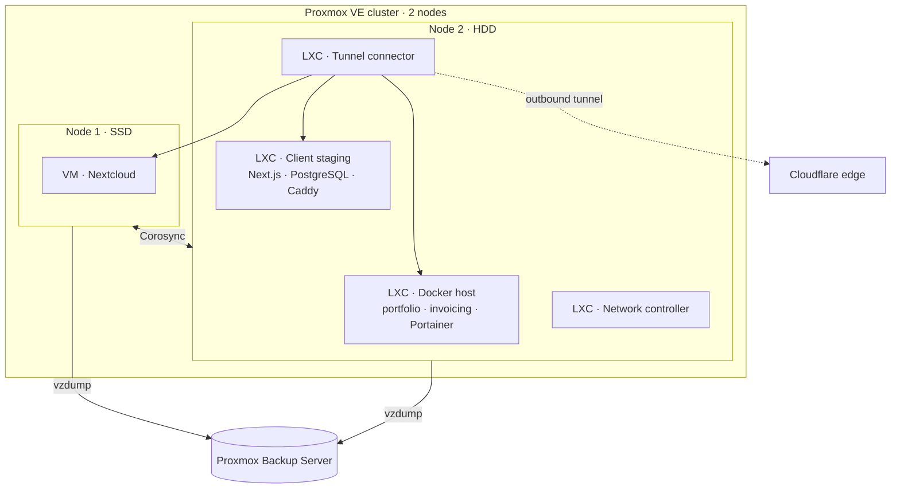

# Architecture Diagram

```mermaid
flowchart TB
    CF[Cloudflare edge]

    subgraph Cluster["Proxmox VE cluster · 2 nodes"]
        subgraph N1["Node 1 · SSD"]
            NC["VM · Nextcloud"]
        end
        subgraph N2["Node 2 · HDD"]
            DK["LXC · Docker host<br/>portfolio · invoicing · Portainer"]
            TUN["LXC · Tunnel connector"]
            NET["LXC · Network controller"]
            STG["LXC · Client staging<br/>Next.js · PostgreSQL · Caddy"]
        end
        N1 <-->|Corosync| N2
    end

    PBS[("Proxmox Backup Server")]

    TUN -. outbound tunnel .-> CF
    TUN --> NC
    TUN --> DK
    TUN --> STG
    N1 -->|vzdump| PBS
    N2 -->|vzdump| PBS
```
