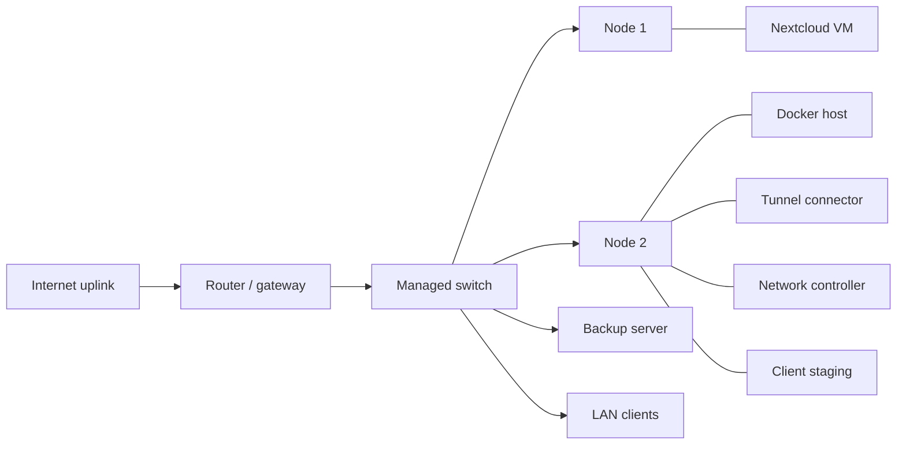

# Network Diagram

```mermaid
flowchart LR
    Up[Internet uplink]
    GW[Router / gateway]
    SW[Managed switch]
    N1[Node 1]
    N2[Node 2]
    PBS[Backup server]
    Clients[LAN clients]

    Up --> GW --> SW
    SW --> N1
    SW --> N2
    SW --> PBS
    SW --> Clients

    N1 --- NC[Nextcloud VM]
    N2 --- DK[Docker host]
    N2 --- TUN[Tunnel connector]
    N2 --- NET[Network controller]
    N2 --- STG[Client staging]
```

Single private network, one Linux bridge per node. No inbound port forwarding — public traffic arrives through the outbound tunnel.
