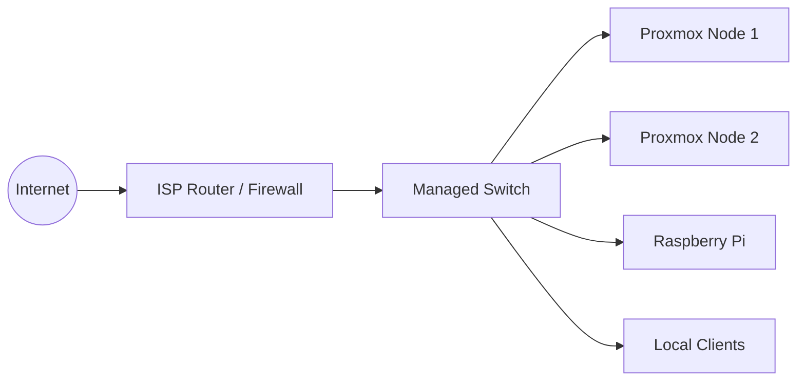

# Network Diagram

```mermaid
flowchart LR
    Internet((Internet))
    Router[ISP Router / Firewall]
    Switch[Managed Switch]
    PVE1[Proxmox Node 1]
    PVE2[Proxmox Node 2]
    Pi[Raspberry Pi]
    Clients[Local Clients]

    Internet --> Router
    Router --> Switch
    Switch --> PVE1
    Switch --> PVE2
    Switch --> Pi
    Switch --> Clients
```
